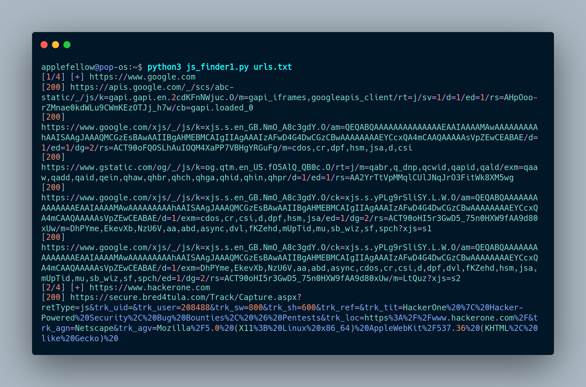

# js_finder
js_finder is tool developed in python3 to fetch all the .js file from the source code of the giver url's list.<br/>
eg: python3 af@jsfinder.py urls.txt<br/>
urls.txt contains all the urls <br/>
This tool is developed in python3.<br/>
The tool finding .js files from the source code of the given website url.<br/>
updation will be available in future.<br/> 



# Installation
python
------
need python3 

```sh
▶ sudo apt update
▶ sudo apt install software-properties-common
▶ sudo add-apt-repository ppa:deadsnakes/ppa
▶ sudo apt update
▶ sudo apt install python3.8
```
that's it... finally check with 'python --version'

pip3
----
```sh
▶ sudo apt install python3-pip
▶ pip3 --version
```
Requirements
------------
```sh
▶ pip3 install -r requirements.txt
```
Chromedriver
------------
js_finder works with chromedriver.I have already attached the latest version of the chromedriver with this repository.you can use it or download the latest version of chromedriver bynary file from [here](https://chromedriver.chromium.org/getting-started).</br>
And put the driver in the same directory of the js_finder file</br>
This tool uses headless chrome with the help of selenium library</br>.
